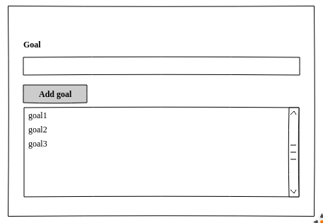
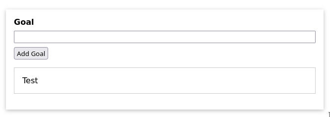

`Vue.js` est un framework (ensemble d'outil) en javascript qui permet de développer des interfaces web très interactifs. 

# I. Installation de Vue.js
L'installation peut se faire:
- en téléchargeant un fichier javascript ` vue.js` au https://cdn.jsdelivr.net/npm/vue/dist/vue.js. Une fois qu'on a téléchargé le fichier js. on peut l'intégrer directement dans le code de la page comme suit:

    ```html
    <html>
    <head>
        <script type = "text/javascript" src = "vue.min.js"></script>
    </head>
    <body></body>
    </html>
    ```

- utiliser `npm` (Node Package Manager) mais cela sous-entend qu'on doit installer `node.js` (mais c'est la méthode recommandée).

- Utilise l'interface en ligne de commande (CLI = Command Line Interface) de `Vue.js`. Cela requiert également l'installation de npm. Cependant, c'est la plus intéressant car cela nous permettra de générer les squelettes des applications sans perdre du temps à les coder.

Pour commencer à utiliser `Vue.js`, nous allons utiliser juste le fichier javascript téléchargé.

Allez sur le site https://vuejs.org/v2/guide/installation.html et choisir la version de développement.


# II. Les manières d'utiliser Vue
Globalenemnt, on peut utiliser `Vue` de 2 manières:
- pour contrôler des parties de pages (seulement des petits bouts de la page). Par exemple pour le rendre interactif mais que le reste du site reste comme avant.


- pour contrôler toute une page. Cette approche consiste à contrôler toute une page avec Vue et donc Vue sert à envoyer des éléments à cette page. En général c'est une page unique qu'on met à jour (d'où son nom de `Single Page Application`). Dans ce cas, c'est le code qu'on crée avc `Vue.js` qui définit ce qui est rendue dans la page


Dans tout le cours, nous allons travailler les 2 approches.

# III. Première applcation en Javascript
L'application que nous allons developper en premier est une application simple qui permet de rajouter un élément à une liste d'objectif. Cette application nous permettra d'avoir un petit projet simple pour commencer.

La maquette de ce projet est comme suit:



L'idée simple est de pouvoir rajouter de nouveaux goals dans la listbox en dessous.


Nous allons commencer avec un projet déjà créé (vous pourrez prendre le fichier `5.1 gs-01-starting-project.zip`), composé des fichiers simples ci-dessous:
- un fichier `index.html` (avec du code déjà)
- un fichier `app.js` (vide)
- un fichier `style.css` (avec du code déjà)

Vu que notre cours sera sur `Vue.js`, je vais vous montrer rapidement comment nous avons fait l'IHM avec HTML et CSS mais ce sera considéré déjà su.
Je vous conseille quand même de regarder le contenu du fichier `index.html` et `style.css` pour les comprendre.


Dans le fichier `index.html`, nous avons ceci (dans lequel je vais insérer des commentaires):

```html
<!DOCTYPE html>
<html lang="en">
  <head>
    <meta charset="UTF-8" />
    <!-- pour permettre la detection de la largeur du device pour faire du media query -->
    <meta name="viewport" content="width=device-width, initial-scale=1.0" />
    <title>A First App</title>
    <!-- liaison du fichier css avec le html-->
    <link rel="stylesheet" href="styles.css" />
  </head>
  <body>
    <!-- nous avons déclaré un div avec un id app pour fixer que notre application Vue va gérer seulement ce div -->
    <div id="app">
      <div>
          <!-- creation d'un label html5 pour avoir le texte goal-->
        <label for="goal">Goal</label>
        <!-- creation d'un inputbox de type text(html5) pour pouvoir entrer le goal -->
        <input type="text" id="goal" />
        <!--bouton "Add goal"-->
        <button>Add Goal</button>
      </div>
      <!-- creation de la liste de goal en dessous.Contrairement à la maquette, nous avons une simple liste numeroté ou avec des bullets-->
      <ul>
        <li>Test</li>
      </ul>
    </div>
    <!-- liaison du fichier app.js qui contiendra notre application Vue en Javascript -->
    <script src="app.js"></script>
  </body>
</html>
```

Le fichier `style.css` contient le contenu suivant (que je vais commenter pour faciliter l'explication)

```css
/*ce bout de code permet d'initialiser le box model 
de notre projet (pour tous les éléments). Les propriétés 'width' et 'height' incluent le contenu, 
le remplissage (padding), la bordure, mais pas la marge.
*/
* {
  box-sizing: border-box;
}

/* fixe une police de fonts pour toute la page html*/
html {
  font-family: sans-serif;
}

/* la marge du corps sera 0 margin avec un seul
argument définit les marges des 4 côtés à 0*/
body {
  margin: 0;
}

/* définition du margin, du max-width (largeur max) et
du padding du div app 
Rappel sur l'unité px, em, % et rem (https://grafikart.fr/tutoriels/font-size-rem-em-px-477
 ( à lire - très important)
*/
#app {
  margin: 3rem auto;
  max-width: 40rem;
  padding: 1rem;
  /** 
  permet d'entourer le div app par une boite ombragé pour simuler une fenetre windows. 
  Pour la syntax d'utilisation  de box-shadow: https://developer.mozilla.org/fr/docs/Web/CSS/box-shadow (attention aux nombres de paramètres)

  Pour d'autres exemples de box-shadown, voir ici https://getcssscan.com/css-box-shadow-examples
  
  */
  box-shadow: 0 2px 8px rgba(0, 0, 0, 0.26);
}

/** mise en forme des label et input (éléments de fenetre)
ainsi que des marges et de leur largeur de ces éléments
on rappelle que display:block permet d'afficher un élément sur une ligne entière (rappel et doc https://www.w3schools.com/cssref/tryit.asp?filename=trycss_display)
*/
label, input {
  margin-bottom: 0.5rem;
  display: block;
  width: 100%;
}
/** fixe le font en gras pour le label */
label {
  font-weight: bold;
}

/* cache les puces ou numéros de la liste 
https://www.w3schools.com/cssref/pr_list-style.asp
*/
ul {
  list-style: none;
  margin: 1rem 0;
  padding: 0;
}

/** formattage de la liste afin d'avoir une bordure qui simule une boite */
li {
  margin: 1rem 0;
  padding: 1rem;
  border: 1px solid #ccc;
}
```

Avec ces css, nous obtenons l'IHM ci-dessous quand on lance `index.html`

 - presque la même chose que dans la maquette.


Maintenant que nous avons compris ce qu'on a, nous allons 