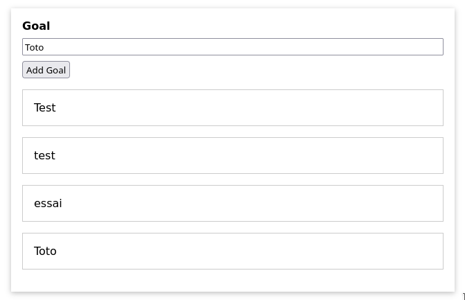
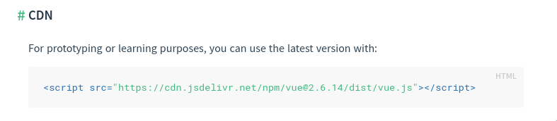
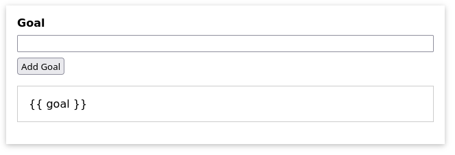
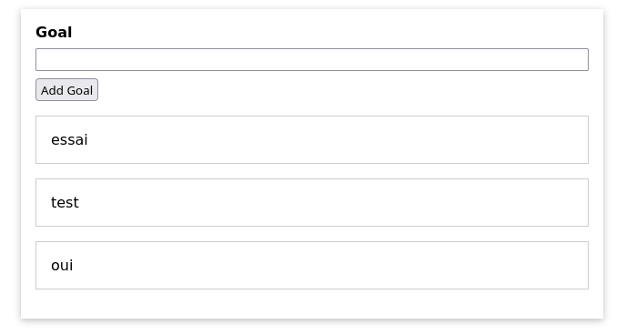

`Vue.js` est un framework (ensemble d'outil) en javascript qui permet de développer des interfaces web très interactifs. 

# I. Installation de Vue.js
L'installation peut se faire:
- en téléchargeant un fichier javascript ` vue.js` au https://cdn.jsdelivr.net/npm/vue/dist/vue.js. Une fois qu'on a téléchargé le fichier js. on peut l'intégrer directement dans le code de la page comme suit:

    ```html
    <html>
    <head>
        <script type = "text/javascript" src = "vue.min.js"></script>
    </head>
    <body></body>
    </html>
    ```

- utiliser `npm` (Node Package Manager) mais cela sous-entend qu'on doit installer `node.js` (mais c'est la méthode recommandée).

- Utilise l'interface en ligne de commande (CLI = Command Line Interface) de `Vue.js`. Cela requiert également l'installation de npm. Cependant, c'est la plus intéressant car cela nous permettra de générer les squelettes des applications sans perdre du temps à les coder.

Pour commencer à utiliser `Vue.js`, nous allons utiliser juste le fichier javascript téléchargé.

Allez sur le site https://vuejs.org/v2/guide/installation.html et choisir la version de développement.


# II. Les manières d'utiliser Vue
Globalenemnt, on peut utiliser `Vue` de 2 manières:
- pour contrôler des parties de pages (seulement des petits bouts de la page). Par exemple pour le rendre interactif mais que le reste du site reste comme avant.


- pour contrôler toute une page. Cette approche consiste à contrôler toute une page avec Vue et donc Vue sert à envoyer des éléments à cette page. En général c'est une page unique qu'on met à jour (d'où son nom de `Single Page Application`). Dans ce cas, c'est le code qu'on crée avc `Vue.js` qui définit ce qui est rendue dans la page


Dans tout le cours, nous allons travailler les 2 approches.

# III. Première application en Javascript
L'application que nous allons developper en premier est une application simple qui permet de rajouter un élément à une liste d'objectif. Cette application nous permettra d'avoir un petit projet simple pour commencer.

La maquette de ce projet est comme suit:


L'idée simple est de pouvoir rajouter de nouveaux goals dans la listbox en dessous.


Nous allons commencer avec un projet déjà créé (vous pourrez prendre le fichier `5.1 gs-01-starting-project.zip`), composé des fichiers simples ci-dessous:
- un fichier `index.html` (avec du code déjà)
- un fichier `app.js` (vide)
- un fichier `style.css` (avec du code déjà)

Vu que notre cours sera sur `Vue.js`, je vais vous montrer rapidement comment nous avons fait l'IHM avec HTML et CSS mais ce sera considéré déjà su.
Je vous conseille quand même de regarder le contenu du fichier `index.html` et `style.css` pour les comprendre.


Dans le fichier `index.html`, nous avons ceci (dans lequel je vais insérer des commentaires):

```html
<!DOCTYPE html>
<html lang="en">
  <head>
    <meta charset="UTF-8" />
    <!-- pour permettre la detection de la largeur du device pour faire du media query -->
    <meta name="viewport" content="width=device-width, initial-scale=1.0" />
    <title>A First App</title>
    <!-- liaison du fichier css avec le html-->
    <link rel="stylesheet" href="styles.css" />
  </head>
  <body>
    <!-- nous avons déclaré un div avec un id app pour fixer que notre application Vue va gérer seulement ce div -->
    <div id="app">
      <div>
          <!-- creation d'un label html5 pour avoir le texte goal-->
        <label for="goal">Goal</label>
        <!-- creation d'un inputbox de type text(html5) pour pouvoir entrer le goal -->
        <input type="text" id="goal" />
        <!--bouton "Add goal"-->
        <button>Add Goal</button>
      </div>
      <!-- creation de la liste de goal en dessous.Contrairement à la maquette, nous avons une simple liste numeroté ou avec des bullets-->
      <ul>
        <li>Test</li>
      </ul>
    </div>
    <!-- liaison du fichier app.js qui contiendra notre application Vue en Javascript -->
    <script src="app.js"></script>
  </body>
</html>
```

Le fichier `style.css` contient le contenu suivant (que je vais commenter pour faciliter l'explication)

```css
/*ce bout de code permet d'initialiser le box model 
de notre projet (pour tous les éléments). Les propriétés 'width' et 'height' incluent le contenu, 
le remplissage (padding), la bordure, mais pas la marge.
*/
* {
  box-sizing: border-box;
}

/* fixe une police de fonts pour toute la page html*/
html {
  font-family: sans-serif;
}

/* la marge du corps sera 0 margin avec un seul
argument définit les marges des 4 côtés à 0*/
body {
  margin: 0;
}

/* définition du margin, du max-width (largeur max) et
du padding du div app 
Rappel sur l'unité px, em, % et rem (https://grafikart.fr/tutoriels/font-size-rem-em-px-477
 ( à lire - très important)
*/
#app {
  margin: 3rem auto;
  max-width: 40rem;
  padding: 1rem;
  /** 
  permet d'entourer le div app par une boite ombragé pour simuler une fenetre windows. 
  Pour la syntax d'utilisation  de box-shadow: https://developer.mozilla.org/fr/docs/Web/CSS/box-shadow (attention aux nombres de paramètres)

  Pour d'autres exemples de box-shadown, voir ici https://getcssscan.com/css-box-shadow-examples
  
  */
  box-shadow: 0 2px 8px rgba(0, 0, 0, 0.26);
}

/** mise en forme des label et input (éléments de fenetre)
ainsi que des marges et de leur largeur de ces éléments
on rappelle que display:block permet d'afficher un élément sur une ligne entière (rappel et doc https://www.w3schools.com/cssref/tryit.asp?filename=trycss_display)
*/
label, input {
  margin-bottom: 0.5rem;
  display: block;
  width: 100%;
}
/** fixe le font en gras pour le label */
label {
  font-weight: bold;
}

/* cache les puces ou numéros de la liste 
https://www.w3schools.com/cssref/pr_list-style.asp
*/
ul {
  list-style: none;
  margin: 1rem 0;
  padding: 0;
}

/** formattage de la liste afin d'avoir une bordure qui simule une boite */
li {
  margin: 1rem 0;
  padding: 1rem;
  border: 1px solid #ccc;
}
```

Avec ces css, nous obtenons l'IHM ci-dessous quand on lance `index.html`

 - presque la même chose que dans la maquette.

## III.1 Javascript sans Vue

Maintenant que nous avons compris ce qu'on a, nous allons le coder (pour l'instant sans Vue)

- selectionner le seul bouton avec `querySelector`:
  ```js
    const buttonEl = document.querySelector('button');
  ```
- selectionner la seule `input` dans le document.
  ```js
    const inputEl = document.querySelector('input');
  ```
- selectionner également la liste dans lequel nous allons rajouter les "objectifs".
  ```js
    const listEl = document.querySelector('ul');
  ```
- Rajouter une fonction `addGoal` qui nous sera notre `callback` quand le bouton sera clické.
  ```js
    function addGoal()
    {

    }
  ```
- Dans cette fonction, nous allons mettre le traitement que nous devons faire (en l'occurrence rajouter l'élément dans la liste)
  ```js
      //récupérer l'input
      const enteredValue = inputEl.value;
      // nous allons créer le nouvel élément comme suit <li>enteredValue</li> et nous allons rajouter 
      // tout cela texte dans l'élément selectionné avec le <ul> (la variable listEl)
      // pour la création, on peut utiliser createElement de javascript pour créer un élément.
      const listLiElement = document.createElement('li');
      // nous allons ensuite définir le contenu text dans cet élément nouvellement créée
      listLiElement.textContent = enteredValue;
      //enfin nous allons placer l'élément listLiElement dans la list <ul> listEl
      listEl.appendChild(listLiElement); 

  ```
- On peut maintenant rajouter un event `click` au bouton.
  ```js
    buttonEl.addEventListener('click')
  ```
Tester. 

Si tout se passe bien, vous devriez avoir un programme qui rajoute à chaque fois le texte que vous tapez dans la liste, comme ceci:



Toute fois, il manque un dernier petit truc, ilfaut effacer l'inputbox quand on a cliqué sur le bouton pour qu'on puisse entrer le nouveau texte sur une zone de texte propre. Pour cela, dans le code de la fonction, rajouter juste à la fin:


```js
  // on force le contenu de l'input à une valeur vide (même pas un espace)
  inputEl.value="";
```
retester et vous avez fini ce petit projet (pour l'instant sans vue.js) 

Dans le prochain étape, nous allons refaire le même petit projet avec Vue pour vous montrer les avantages de Vue.

## III.1 Le même projet avec Vue
Nous allons recoder le même projet avec Vue.
Reprenez la même base de code et commentez tout dans le fichier `app.js`. 
Ensuite, nous allons aller sur le site https://v3.vuejs.org/guide/installation.html#vue-devtools 
(si vous souhaitez utiliser Vue2, alors utilisez ce lien https://vuejs.org/v2/guide/installation.html) et chercher le paragraphe `#CDN`. et nous allons récupérer le code dans cdn :



et le coller dans le fichier `index.html` pour avoir `vue.js` dans notre code (comme ci-dessous).
La version que vous avez peut ne pas être la même mais ce n'est pas grave. 
Pour l'instant, nous allons utiliser `Vue3`, vous pourrez utiliser le lien ci-dessous.

```html
  <script src="https://unpkg.com/vue@next"></script>
   <script src="app.js"></script>
```

Maintenant que nous avons compris ce qu'on a fait auparavant, nous allons comment le faire avec `Vue`.

Nous remarquons qu'actuellement, le code html contient une liste d'obectifs en dur:

```html
 <ul>
    <li>Test</li>
 </ul>
```
Pour chaque click sur le bouton, nous allons rajouter une nouvelle balise `<li>...</li>` afin de rajouter l'objectif dans la liste. On le fera au début en Javascript pur.
L'algorithme sera la suivante:
- récupérer le texte saisie dans la zone `input`.
- rajouter un texte avec une balise `<li>` dans la partie `<ul>` du code html.

Pour cela, nous devons avoir accès aux champs:
- `<input>` pour récupérer ce qu'il contient,  
- `<button>` pour pouvoir lui attacher un évènement
- `<ul>` pour pouvoir rajouter des éléments dedans.

Pour cela, nous allons déjà commencer par créer quelques constantes en Javascript qui contiendront les éléments qui nous permettront de travailler.

Qu'est-ce qui change? 
Nous avons tout d'abord besoin de créer une application `Vue` 
- la création de l'application
  ```js
    Vue.createApp({});
  ```
- cette application peut prendre un objet javasdcript en argument (qu'on fournit entre accolade)
  ```js
  {
    data:
  }
  ```
  En fait,  on définit comme `data` dans l'objet Vue, tout ce qui sera manipulé. le nom doit être ` data` (et pas autre chose). Dans notre cas, nous allons avoir besoin de la liste des objectifs, et nous allons avoir besoin de la zone de texte que l'utilisateur a entré.

- Dans la réalité, `data` est une fonction qui retournera des données (les données que nous allons manipuler)

```js
{
  // on peut aussi écrire data= function() {}
  data(){
    //la fonction doit retourner un/des objets
    // nous allons retourner les données que notre application doit manipuler.
    // nous allons voir cela de plus près dans les chapitres suivants.
    // l'instant, nous allons mettre notre liste d'objectif (qui est initialement un tableau vide)
    return {
      goals:[],
      // et également la valeur entrée enteredValue (qui est une chaine vide initialement)
      entedValue:""
    }
  }
}
```
ce qui est important à comprendre est que les données mises dans cet objet est dans le scope de Vue (`Vue` les voit et peut les manipuler)

- Pour connecter la partie html à `Vue`, nous pourrons utiliser des `directives` (ce sont des attributs html spécifiques)
Pour notre `input` par exemple, nous pourrons utiliser la directive `v-model="nom_model"` (nous allons voir cela plusieurs fois dans la suite mais ici c'est juste pour montrer les capabilités de `Vue`). Pour lier le code `Vue` au code html, nous allons donner comme nom de model de l'input, le nom de la variable qu'on a souhaité associer à l'input dans le code `Vue` (pour notre cas, c'est `enteredValue`).
Le code HTML de l'input devient alors comme suit
```html
  <input type="text" id="goal" v-model="enteredValue"/>
```
Cela permettra d'établir une connexion entre la donnée que nous allons entrer dans la zone de texte manuellement, et la propriété `enteredValue` dans la donnée `data` dans le code `Vue`. `Vue` va automatiquement "gérer" la variable pour nous (il va automatiquement "écouter" ce qui est entré dans la zone et mettre à jour en temps réel la valeur de la variable `enteredValue`) 

- pour les actions à faire: nous souhaitons prendre ce qui est mis dans `enterValue` (quand on click sur le bouton) et le rajouter à la liste `goals` (qui, comme on le voit est aussi dans la `data`).
Pour les actions, nous pouvons rajouter dans la méthode `createApp`, une nouvelle donnée appelé `methods` comme ci-dessous. Nous pourrons alors rajouter dans l'objet javascript ` methods` des méthodes et des fonctions qui peuvent être appelés à partir du code html. Ci-dessous également, dans le code nous avons alors rajouter la méthode ` addGoal()` (lire le commentaire).

Attention: Si vous voulez utiliser Vue3 alors, le code ci-dessous est valable avec `createApp`

```js
Vue.createApp({
  data() {
    //la fonction doit retourner un/des objets
    // nous allons retourner les données que notre application doit manipuler.
    // nous allons voir cela de plus près dans les chapitres suivants.
    // l'instant, nous allons mettre notre liste d'objectif (qui est initialement un tableau vide)
    return {
      goals:[],
      // et également la valeur entrée enteredValue (qui est une chaine vide initialement)
      entedValue:""
    }
  },
  methods:{
    addGoal(){
      //si nous utilisons une donnée dans data, on doit utiliser this (pour dire que c'est une donnée de data). Cela permettra à `Vue` d'établir la connexion en backend.
      this.goals.push(this.enteredValue);
    }
  }
}).mount('#app');
```
*** Si vous voulez utiliser Vue2 ***
Si toutefois, vous vous interessez à `Vue2`, createApp ne fonctionnera pas car vous aurez alors des problèmes de message d'erreur du type:

```sh

```

Pour `Vue2`, il faut utiliser le code suivant. Ne pas oublier la propriété `el` qui spécifie l'identifiant `html` que doit contrôler `Vue` (il doit s'appeler `el` et pas autre chose):

```js
new Vue({
    el: "#app",
    data(){

        //la fonction doit retourner un/des objets
        // nous allons retourner les données que notre application doit manipuler.
        // nous allons voir cela de plus près dans les chapitres suivants.
        // l'instant, nous allons mettre notre liste d'objectif (qui est initialement un tableau vide)
        return {
            goals:[],
            // et également la valeur entrée enteredValue (qui est une chaine vide initialement)
            enteredValue:""
        }
    },
    methods:{
        addGoal(){
          //si nous utilisons une donnée dans data, on doit utiliser this (pour dire que c'est une donnée de data). Cela permettra à `Vue` d'établir la connexion en backend.
          this.goals.push(this.enteredValue);
        }
      }
});
```
Ne pa oublier le lien html `<script>` pour pointer vers `Vue2`
```html
<script src="https://cdn.jsdelivr.net/npm/vue@2.6.0"></script>
```

- Maintenant, nous souhaitons relier le code html avec cette fonction de manière à que chaque fois que le bouton est cliqué alors`addGoal` est executé. Comment fait-on? Là encore, très facile: on utilise la directive `v-on:evenement="nom_fonction"` (ex: `v-on:click="addGoal"`). Et il faut mettre cette directive en tant qu'attribut du code html du button pour que l'évènement (ici `click`) du bouton soit opérationnel. Le code sera comme suit:
```html
...
...
  <button v-on:click="addGoal">Add Goal</button>
```
Pour le tester, modifier le code dans la fonction `addGoal()` par un simple ` alert("test");` et en cliquant sur le bouton, on devrait avoir une alerte.
Après le test, remettez le code de `addGoal` comme avant.

- dernière chose, maintenant, il faut coder la partie du code qui rajoute les list `<li>` car pour l'instant, nous les rajoutons dans la variable `goals` mais rien de plus. Pour l'afficher, il faut rajouter une liste `<li>` pour chaque élément dans `goals`. Comment fait-on cela? Nous allons utiliser la directive `v-for` sur l'élément `<li>`. 

En gros, nous avons déjà la list `<ul>` et dedans pour chaque `goal`(un élément) dans `goals`, nous souhaitons créer une liste `<li>` 

```html
 ...
 <ul>
   <li v-for="goal in goals">{{ goal }}</li>
 </ul>
```

A ce stade ça ne fonctionne pas encore. Nous obtenons l'affichage suivant:



Il nous manque juste une toute petite chose. Nous avons créer l'instance de `Vue` dans `app.js` mais nous n'avons pas spécifier sur quelle partie de la page `Vue` doit s'executer. C'est ce qui cause l'erreur.  Nous devons spécifier à `Vue` qu'il doit prendre en charge la balise `div` avec un id `app`. 

Le problème n'apparaît que pour  la version `Vue3`, il faut juste rajouter le bout de code suivant pour la version `Vue3`:
```js
Vue.createApp({
  ....
}).mount('#app');
```

Codez cela et comparez avec le code dans le commit suivant.

Une dernière petite chose: 
- quand on  cliqué sur le bouton, il faut ensuite effacer le contenu de la zone de texte afin que l'ancien texte n'y reste pas. Donc, nous allons rajouter ce bout de code dans la fonction `addGoal()`
```js
 addGoal(){
   ...
   ...
   this.entedValue="";
  }
```

Vous obtiendrez alors ceci:


