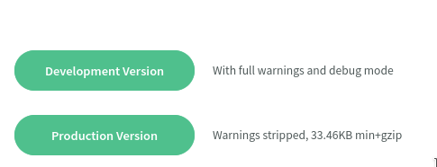
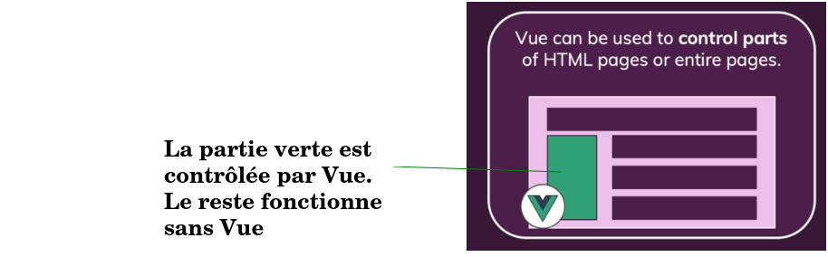
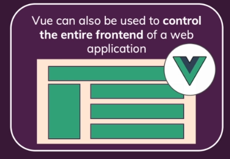

`Vue.js` est un framework (ensemble d'outil) en javascript qui permet de développer des interfaces web très interactifs. 

# I. Installation de Vue.js
L'installation peut se faire:
- en téléchargeant un fichier javascript ` vue.js` au https://cdn.jsdelivr.net/npm/vue/dist/vue.js. Une fois qu'on a téléchargé le fichier js. on peut l'intégrer directement dans le code de la page comme suit:

    ```html
    <html>
    <head>
        <script type = "text/javascript" src = "vue.min.js"></script>
    </head>
    <body></body>
    </html>
    ```

- utiliser `npm` (Node Package Manager) mais cela sous-entend qu'on doit installer `node.js` (mais c'est la méthode recommandée).

- Utilise l'interface en ligne de commande (CLI = Command Line Interface) de `Vue.js`. Cela requiert également l'installation de npm. Cependant, c'est la plus intéressant car cela nous permettra de générer les squelettes des applications sans perdre du temps à les coder.

Pour commencer à utiliser `Vue.js`, nous allons utiliser juste le fichier javascript téléchargé.

Allez sur le site https://vuejs.org/v2/guide/installation.html et choisir la version de développement.



# II. Las manières d'utiliser Vue
Globalenemnt, on peut utiliser `Vue` de 2 manières:
- pour contrôler des parties de pages (seulement des petits bouts de la page). Par exemple pour le rendre interactif mais que le reste du site reste comme avant.



- pour contrôler toute une page. Cette approche consiste à contrôler toute une page avec Vue et donc Vue sert à envoyer des éléments à cette page. En général c'est une page unique qu'on met à jour (d'où son nom de `Single Page Application`). Dans ce cas, c'est le code qu'on crée avc `Vue.js` qui définit ce qui est rendue dans la page


Dans tout le cours, nous allons travailler les 2 approches.

